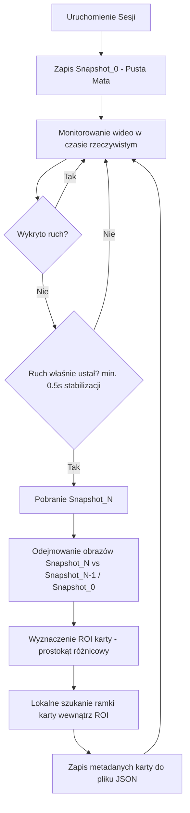

# Zadanie: TV-003-card-detection-diff

## ID zadania:
TV-003-card-detection-diff

## Nazwa zadania:
Nowy moduł detekcji kart oparty na porównywaniu snapshotów (Image Differencing i detekcja ruchu)

## Cel:
Zastąpienie bezpośredniego progowania całego obrazu nową strategią wykrywania kart opartą na różnicach klatek. Algorytm wykryje ruch, poczeka na stabilizację (0.5s), pobierze snapshot i porówna go z referencyjną pustą matą (Snapshot_0). Umożliwi to precyzyjne wyznaczenie obszaru zainteresowania (ROI) z nowo położoną kartą, a następnie precyzyjne odnalezienie jej ramki.

---

## Nowy Workflow Systemu (Krok po Kroku)

---

## Podział na logiczne i krótkie Zadania (Taski)

### Task 1: Detekcja Ruchu i Stabilizacja (`MotionDetector`)
*   **Plik:** `src/tarotvision/camera/motion.py`
*   **Cel:** Monitorowanie zmian na wyprostowanym stole w czasie rzeczywistym.
*   **Logika:** 
    *   Porównujemy klatkę $t$ z klatką $t-1$ (np. `cv2.absdiff` na zmniejszonym obrazie szarym).
    *   Jeśli średnia zmiana pikseli przekracza próg (np. 1.5-2.0), wykrywamy ruch.
    *   Po wykryciu ruchu czekamy na jego ustanie. Gdy poziom zmian spada poniżej progu na czas co najmniej 0.5 sekundy, klasa sygnalizuje stan `STABILIZED` i pozwala pobrać snapshot.

### Task 2: Zarządzanie Sesją i Snapshotami (`SnapshotManager`)
*   **Plik:** `src/tarotvision/storage/snapshots.py`
*   **Cel:** Zarządzanie zapisywaniem i odczytywaniem klatek kluczowych sesji.
*   **Logika:**
    *   Zapis `Snapshot_0.png` (pusta mata) do katalogu sesji `output/sessions/session_<id>/`.
    *   Metoda `save_snapshot(frame, index)` zapisująca kolejne klatki jako `snapshot_1.png`, `snapshot_2.png` itp.
    *   Metoda `get_snapshot(index)` zwracająca wczytany obraz.

### Task 3: Detekcja Obszaru Różnicowego (`DiffDetector`)
*   **Plik:** `src/tarotvision/vision/diff.py`
*   **Cel:** Lokalizacja obszaru (ROI) w którym zaszła zmiana.
*   **Logika:**
    *   Obliczenie bezwzględnej różnicy: `cv2.absdiff(Snapshot_N, Snapshot_0)`.
    *   Progowanie binarne na kanale jasności lub koloru (różnica powinna być idealnie czarna tam gdzie nie ma zmian).
    *   Czyszczenie morfologiczne (otwarcie/domknięcie) w celu usunięcia drobnych szumów.
    *   Wyszukanie największego konturu zmian.
    *   Zwrócenie obwiedni tego konturu jako prostokąt obrócony (ROI) - np. `(cx, cy, w, h, angle)`.

### Task 4: Precyzyjne Dopasowanie Ramki w ROI (`CardRefinery`)
*   **Plik:** `src/tarotvision/vision/refinery.py`
*   **Cel:** Dokładne odnalezienie 4 rogów karty wewnątrz małego, wyciętego obszaru ROI.
*   **Logika:**
    *   Wycięcie obrazu z ROI z małym marginesem (np. 15 pikseli).
    *   Wewnątrz tego małego obrazu szukamy krawędzi karty. Ponieważ tło stołu zostało wyeliminowane, algorytm progowania adaptacyjnego lub detekcji Canny'ego skupi się wyłącznie na samej karcie.
    *   Dopasowanie prostokąta `minAreaRect` i wyznaczenie precyzyjnych rogów (4 punkty) oraz ostatecznego kąta obrotu.
    *   Transformacja współrzędnych rogów z lokalnych (ROI) do globalnych (stół).

### Task 5: Skrypt Integracyjny i Testowy
*   **Plik:** `test_card_detection_diff.py`
*   **Cel:** Pełna weryfikacja przepływu.
*   **Logika:**
    *   Uruchamia podgląd live w oknie.
    *   Czeka na klawisz operatora (np. SPACE), aby zapisać `Snapshot_0`.
    *   Po zapisaniu `Snapshot_0` przechodzi w tryb automatycznego wykrywania ruchu.
    *   Gdy operator położy kartę i zabierze rękę, wykrywa stabilizację, robi `Snapshot_1`.
    *   Wywołuje detekcję różnicową, wycina ROI, dopasowuje kartę.
    *   Zapisuje obraz diagnostyczny `output/processed/table_diff_detected.png` oraz metadane JSON.

---

## Interfejsy danych i integracja
*   Dane o wykrytych kartach są zwracane w dotychczasowym formacie JSON (zgodnym z sekcją 11 pliku `docs/03_metoda_pracy_i_architektura_modularna.md`).
*   Wszystkie obrazy wejściowe są uprzednio wyprostowane do pola maty (TV-004), dzięki czemu współrzędne ROI idealnie odpowiadają układowi 2D stołu.
